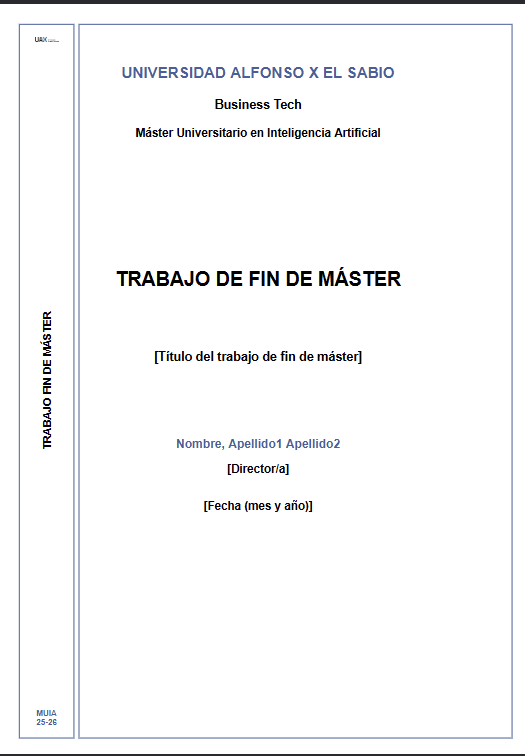

# Plantilla TFM MUIA UAX (LaTeX)




Plantilla de Trabajo Fin de Master para el MU en Inteligencia Artificial (UAX), con bibliografia en formato APA mediante biblatex + biber.

## Uso rapido

1. Escribe tu contenido en los capitulos dentro de `chapters/`.
2. Añade tus fuentes en `referencias.bib`.
3. Cita en el texto y compila con la secuencia completa.

## Estructura principal

- `main.tex`: archivo principal de la plantilla.
- `chapters/01_introduccion.tex` ... `chapters/08_anexos.tex`: secciones del documento en orden.
- `referencias.bib`: base de datos bibliografica.

## Citas APA dentro del texto

Ejemplos de uso:

```tex
Segun \textcite{apellido2024articulo}, la evidencia muestra una relacion significativa.

La evidencia muestra una relacion significativa \parencite{apellido2024articulo}.

Para cita textual: \parencite[p. 67]{apellido2024articulo}.
```

## Compilacion

No es un error que `xelatex` aparezca varias veces.
Con `biblatex` + `biber`, la compilacion va por fases:

1. `xelatex main.tex`: genera auxiliares y `main.bcf`.
2. `biber main`: procesa `referencias.bib` y genera `main.bbl`.
3. `xelatex main.tex`: inserta citas y bibliografia en el PDF.
4. `xelatex main.tex`: estabiliza indice y referencias cruzadas.

Compilacion completa (primera vez o cuando cambias citas/bibliografia):

```bash
xelatex main.tex
biber main
xelatex main.tex
xelatex main.tex
```

Compilacion rapida (si solo cambias texto y no tocas citas/indice):

```bash
xelatex main.tex
```
